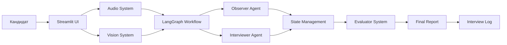

# MegaSchool_AI_track03_LazebnyiVsevolod
# Multi-Agent Interview Coach

<div align="center">

<h1>🤖 Multi-Agent Interview Coach</h1>

<h3>Многоагентная система для проведения технических собеседований с AI</h3>

[](https://python.org)
[](https://streamlit.io)


</div>

> [!NOTE]
> <b>Проект выполнен в рамках трека "Multi-Agent Interview Coach Track 2026</b>

<div align="center">

## 🎯 Интеллектуальный симулятор технических собеседований

</div>

## 🛠️ Технологический стек / Tech Stack

<div style="display: flex; flex-wrap: wrap; gap: 6px; margin-bottom: 15px;">


</div>

- **Бэкенд & AI:** `Python 3.9+`, `LangChain`, `LangGraph`, `Mistral AI`
- **Интерфейс:** `Streamlit` - веб-приложение с реальным временем
- **Компьютерное зрение:** `YOLOv8`, `Ultralytics`, `OpenCV`
- **Аудио-интерфейс:** `SpeechRecognition`, `gTTS`, `PyAudio`
- **Оркестрация агентов:** `LangGraph` для управления workflow
- **Логирование:** `JSON` логгирование всей сессии интервью

## 🧑‍💻 О проекте / About the Project

Интеллектуальная многоагентная система для проведения реалистичных технических собеседований. Система имитирует поведение опытного технического рекрутера и включает скрытого наблюдателя, который анализирует ответы кандидата, проверяет техническую достоверность и управляет ходом собеседования в реальном времени.

Проект реализует принципы **Agentic Workflow** с четким разделением ролей между агентами:
- **Interviewer** ведет диалог с кандидатом
- **Observer/Mentor** анализирует ответы "за кулисами", проверяет факты и дает инструкции
- **Vision System** отслеживает поведение кандидата через камеру
- **Evaluator** оценивает технические ответы и генерирует финальный отчет

## 🏛️ Архитектура и компоненты / Architecture & Components

### Многоагентная архитектура (Multi-Agent System)

<div align="center">



</div>

## 📂 Структура проекта / Project Structure:

```bash
MegaSchool_AI_track03_LazebnyiVsevolod/
├── modules/           # Основные модули системы
│   ├── agents.py     # AI агенты (Observer, Interviewer)
│   ├── graph.py      # LangGraph workflow
│   ├── vision.py     # Компьютерное зрение
│   ├── audio.py      # Голосовой интерфейс
│   ├── evaluator.py  # Система оценки
│   └── utils.py      # Утилиты и логирование
├── run_app.py        # Основной Streamlit скрипт
├── requirements.txt  # Зависимости
└── README.md         # Документация проекта
```

### Ключевые модули системы:

- **`modules/agents.py`** - ядро AI-агентов:
  - **Observer Agent**: Технический лид, анализирует ответы, проверяет достоверность, управляет сложностью вопросов
  - **Interviewer Agent**: Технический рекрутер, ведет диалог на основе инструкций Observer
  - **Feedback Agent**: Генерирует финальный отчет в формате Markdown

- **`modules/graph.py`** - оркестрация workflow:
  - Управление состоянием собеседования через `LangGraph`
  - Маршрутизация между агентами на основе контекста
  - Динамическая адаптация сложности вопросов

- **`modules/vision.py`** - система компьютерного зрения:
  - Детекция объектов в реальном времени с помощью YOLOv8
  - Анализ поведения кандидата (телефон, книги, наличие в кадре)
  - Контекст для Observer Agent о подозрительном поведении

- **`modules/audio.py`** - голосовой интерфейс:
  - Распознавание речи с микрофона (поддержка русского языка)
  - Текст-в-речь через gTTS для озвучки вопросов
  - Интеграция со Streamlit для воспроизведения

- **`modules/evaluator.py`** - система оценки:
  - Анализ технических ответов через Mistral AI
  - Scoring система (0-100 баллов)
  - Генерация детального фидбэка по hard/soft skills

- **`modules/utils.py`** - утилиты и логирование:
  - Сохранение полной сессии в `interview_log.json`
  - Загрузка истории предыдущих интервью

- **`run_app.py`** - основной Streamlit интерфейс:
  - Веб-интерфейс с видеопотоком с камеры
  - Таймеры ответа и управления сессией
  - Интеграция всех модулей в единый UI

## 🚀 Быстрый старт / Quick Start

### Предварительные требования / Prerequisites

- Python 3.9 или выше
- Микрофон и веб-камера (опционально, но рекомендовано)
- API ключ Mistral AI

### Установка и настройка / Setup & Configuration

1. **Клонируйте репозиторий и установите зависимости:**

```bash
# Клонирование репозитория
git clone https://github.com/your-username/MegaSchool_AI_track03_LazebnyiVsevolod.git
cd MegaSchool_AI_track03_LazebnyiVsevolod

# Создание виртуального окружения
python -m venv venv
source venv/bin/activate

# Установка зависимостей
pip install -r requirements.txt
```

2. **Настройка переменных окружения:**

Создайте файл `.env` в корневой директории проекта и добавьте ваш API ключ Mistral AI:

```bash
MISTRAL_API_KEY=your_mistral_api_key_here
```

3. **Запуск модели YOLOv8:**
   
При первом запуске система автоматически скачает модель YOLOv8 (yolov8n.pt, ~6MB). Убедитесь, что у вас есть доступ в интернет для загрузки.

4. **Запуск приложения:**

```bash
# Запуск Streamlit приложения
streamlit run run_app.py

# Или с правами администратора (если требуется доступ к микрофону/камере)
sudo streamlit run run_app.py
```

5. **Доступ к интерфейсу:**

Откройте браузер и перейдите по адресу: `http://localhost:8501`

## 📊 Начало работы с системой

### Настройка собеседования:

1. **В боковой панели заполните:**
   - Имя кандидата
   - Позицию (Python Backend, Frontend React, Data Scientist)
   - Грейд (Junior, Middle, Senior)
   - Количество вопросов (1-50)

2. **Опциональные настройки:**
   - Включите/выключите озвучку вопросов
   - Проверьте работу микрофона кнопкой "Проверить звук"
   - Установите время ответа на вопрос

3. **Запуск собеседования:**
   - Нажмите "Начать собеседование"
   - Система загрузит модель YOLOv8 и инициализирует агентов
   - Первый вопрос будет задан автоматически

### Режимы ответа:

- **🎤 Голосовой ввод:** Нажмите "Записать голос" и говорите четко
- **⌨️ Текстовый ввод:** Введите ответ в текстовое поле
- **⏱️ Таймер:** Система автоматически перейдет к следующему вопросу через 2 минуты без ответа

### Мониторинг через Vision System:

- **Камера:** Верхняя часть интерфейса показывает поток с камеры
- **Анализ:** YOLOv8 детектирует объекты (телефон, книги, человека)
- **Алерты:** Система предупреждает если кандидат использует телефон или отсутствует в кадре

## 🤖 Работа AI агентов / AI Agents Workflow

### Скрытая рефлексия (Hidden Reflection)

Каждый ответ кандидата проходит через два уровня анализа:

1. **Observer Agent анализирует:**
   - Техническую достоверность ответа
   - Поведение через данные с камеры
   - Контекст предыдущих ответов
   - Принимает решение об изменении сложности

2. **Внутренние мысли сохраняются в лог:**
```json
{
  "thought_process": "Кандидат упомянул async/await, но не знает про event loop. Нужно углубиться.",
  "next_instruction": "Спроси про event loop в asyncio",
  "difficulty_adjustment": 1,
  "status": "continue"
}
```

3. **Interviewer Agent получает инструкцию** и формулирует следующий вопрос

### Адаптивная сложность (Adaptive Difficulty)

- **Упрощение (-1):** Если кандидат ошибается или отвечает "не знаю"
- **Сложность (0):** Сохранение текущего уровня
- **Усложнение (+1):** Если ответ полный и технически верный

### Контекстная осведомленность (Context Awareness)

Система сохраняет историю из 3 последних ответов и использует ее для:
- Избегания повторных вопросов
- Построения логической последовательности
- Учета ранее упомянутых кандидатом технологий

## 📊 Финальный отчет / Final Feedback

После завершения собеседования система генерирует детальный отчет в формате Markdown:

### Структура отчета:

```markdown
# Результат собеседования
**Позиция:** Python Backend Developer
**Грейд:** Middle
**Решение:** Hire / No Hire

# Технический анализ (Hard Skills)
## ✅ Подтвержденные навыки:
- Асинхронное программирование (asyncio)
- Работа с базами данных (PostgreSQL)
- Основы алгоритмов

## ❌ Пробелы в знаниях:
- Оптимизация запросов (JOIN vs SUBQUERY)
- Паттерны проектирования (не знает Observer)

# Поведенческий анализ (Soft Skills)
- **Ясность изложения:** 8/10
- **Честность:** 9/10 (признал незнание)
- **Вовлеченность:** 7/10 (задавал встречные вопросы)

# Рекомендации для развития
1. Изучить паттерны проектирования (Observer, Strategy)
2. Практиковать оптимизацию SQL-запросов
3. Углубиться в архитектурные паттерны (CQRS, Event Sourcing)
```

## 📂 Логирование и воспроизведение / Logging & Replay

### Формат лога интервью:

Система сохраняет полную сессию в `interview_log.json`:

```json
{
  "participant_name": "Иван Иванов",
  "turns": [
    {
      "turn_id": 1,
      "agent_visible_message": "Привет! Расскажи про свой опыт с Python.",
      "user_message": "Работаю 2 года, в основном бэкенд на Django.",
      "internal_thoughts": "[Observer]: Кандидат упомянул Django. [Vision]: Телефон не обнаружен."
    }
  ],
  "final_feedback": "# Результат...",
  "vision_alerts": ["ALERT: Phone detected at turn 5"],
  "difficulty_progression": [5, 6, 5, 7, 6],
  "timestamps": ["2024-01-15 10:00:00", ...]
}
```

### Возможности логов:

1. **Анализ эффективности:** Какие вопросы вызывают затруднения
2. **Воспроизведение:** Полная реконструкция сессии
3. **Обучение модели:** Данные для fine-tuning
4. **Аудит:** Проверка объективности оценки

## 🧪 Применение в реальных сценариях / Real-World Use Cases

### Для компаний и HR:
- **Предварительный скрининг:** Автоматизация первого этапа собеседований
- **Объективная оценка:** Минимизация human bias
- **Масштабирование:** Проведение множества собеседований одновременно
- **Аналитика:** Выявление общих пробелов у кандидатов

### Для кандидатов:
- **Подготовка к собеседованиям:** Практика в реалистичных условиях
- **Обратная связь:** Детальный разбор сильных и слабых сторон
- **Тренировка soft skills:** Работа с поведенческими аспектами
- **Адаптивная сложность:** Персонализированный уровень вопросов

### Для учебных заведений:
- **Оценка знаний студентов:** Автоматизированная проверка навыков
- **Подготовка к трудоустройству:** Симуляция реальных собеседований
- **Анализ учебных программ:** Выявление пробелов в обучении

### Кастомизация под конкретные роли:

1. **Бэкенд разработчик:**
   - Вопросы по базам данных, API, микросервисам
   - Практические задачи по оптимизации

2. **Фронтенд разработчик:**
   - React/Vue/Angular специфичные вопросы
   - Задачи по производительности UI

3. **Data Scientist:**
   - Статистика, ML модели, feature engineering
   - Кейсы по обработке данных

### Логирование ошибок:

Система сохраняет ошибки в отдельный файл:
```bash
# Просмотр логов ошибок
tail -f interview_errors.log

# Подробный режим запуска для отладки
streamlit run run_app.py --logger.level=debug
```

## 📈 Дальнейшее развитие / Future Development

### Планируемые улучшения:

1. **Поддержка большего количества моделей LLM:**
   - OpenAI GPT-4
   - Anthropic Claude
   - Локальные модели (Llama, Mistral 7B)

2. **Расширенная аналитика:**
   - Сравнение кандидатов по когортному анализу
   - Прогнозирование успешности найма
   - Рекомендации по вопросам на основе успешности

3. **Интеграция с платформами:**
   - LinkedIn Profile parsing
   - GitHub code analysis
   - LeetCode/HackerRank интеграция

4. **Мультиязычная поддержка:**
   - Английский, немецкий, французский языки
   - Культурные адаптации вопросов

## 📜 Лицензия / License

> [!IMPORTANT]
> Этот проект распространяется как open-source решение для образовательных и исследовательских целей.
> Использование в коммерческих продуктах требует дополнительного согласования.

---

<div align="center">

## ⭐ Если проект вам понравился, поставьте звезду на GitHub!

**Автор:** Всеволод Лазебный  
</div>
